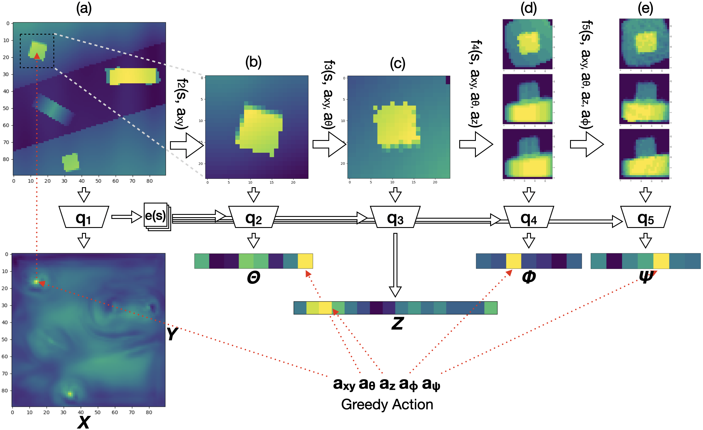

In the spatial action representation, the action space spans the space of target poses for robot motion commands, i.e. SE(2) or SE(3). This approach has been used to solve challenging robotic manipulation problems and shows promise. However, the method is often limited to a three dimensional action space and short horizon tasks. This paper proposes ASRSE3, a new method for handling higher dimensional spatial action spaces that transforms an original MDP with high dimensional action space into a new MDP with reduced action space and augmented state space. We also propose SDQfD, a variation of DQfD designed for large action spaces. ASRSE3 and SDQfD are evaluated in the context of a set of challenging block construction tasks. We show that both methods outperform standard baselines and can be used in practice on real robotics systems.

	

Our model learns to select action sequentially. q1

## Video

	<iframe width="853" height="480" src="https://www.youtube.com/embed/FiHoIF1oLZs" frameborder="0" allow="autoplay; encrypted-media" allowfullscreen></iframe>

